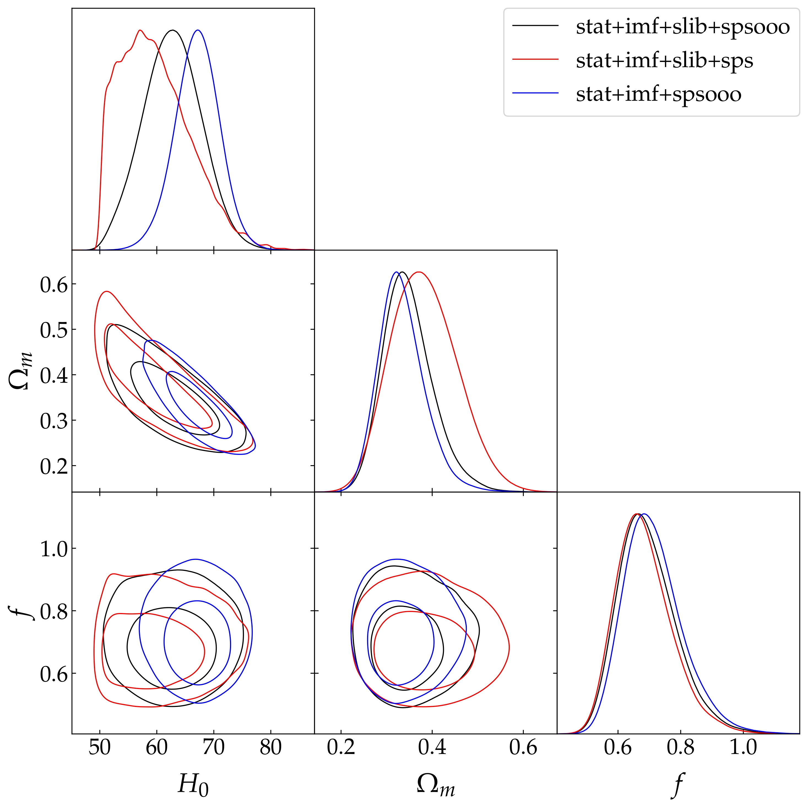

# Correção nas incertezas dos dados de cronômetros cósmicos

Esse código realiza uma análise para identificar e corrigir uma possível superestimação nas incertezas dos dados de cronômetros cósmicos.
O valor da superestimação é estimado via inferência bayesiana, sendo este um parâmetro livre assim como os parâmetros do modelo. A amostragem é realizada via `emcee`, que usa o método MCMC invariante afim.

## Dependências
- numpy
- matplotlib
- emcee
- getdist
- scipy

As dependências podem ser instaladas via `pip install -r redist.txt`.

## Funcionamento

Os notebooks devem ser executados de forma independente:
- `Panth_correction.ipynb`: teste de validação do método de correção no conjunto de dados Pantheon.
- `CC_met_sep.ipynb`: aplica o método de correção aos dados de cronômetros cósmicos separando-os em dois grupos baseado no método de obtenção.
- `CC_correction_diffMat.ipynb`: aplica o método a todos os dados de cronômetros cósmicos para diferentes combinações da matriz de covariância.

## Dados
- Cronômetros cósmicos compilados em [Moresco (2024)](https://arxiv.org/abs/2412.01994).
- Catálogo de supernovas Ia do Pantheon, usado na etapa de validação (https://pantheonplussh0es.github.io/).

## Resultados
A figura mostra os resultados para três estruturas diferentes para a matriz de covariância, cada uma considerando diferentes erros sistemáticos.

A tabela abaixo contém os resultados numéricos:
| Combinação | $H_{0}$ | $\Omega_{m}$ | $f$ |
| ---------- | ------- | ------------ | --- |
|$C_{1}$ | $62.7 ^{+5.1}_{-5.2}$ | $0.35 \pm 0.05$ | $0.70 \pm 0.10 $|
|$C_{2}$ | $59.7 \pm 6.4$ | $0.38 \pm 0.07$ | $0.68 \pm 0.09 $|
|$C_{3}$ | $67.1 \pm 3.8$ | $0.33 \pm 0.05$ | $0.71 \pm 0.09 $|
